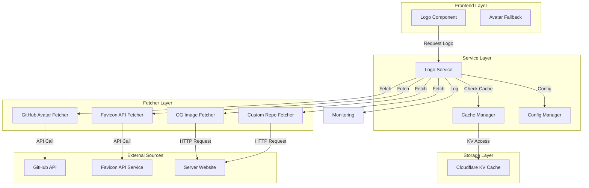
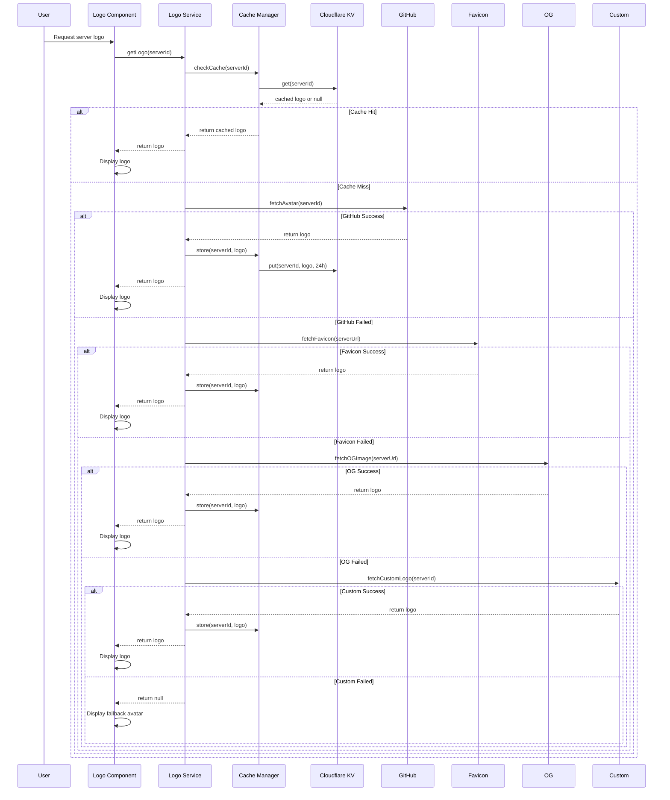
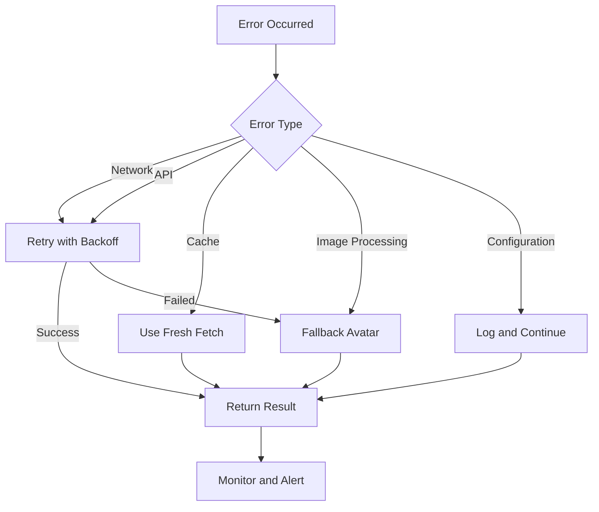

# Icon/Logo System Design Document

## Overview

This document outlines the design for a comprehensive icon/logo system for MCP servers in the directory. The system replaces first-letter gradient avatars with actual project logos while maintaining robust fallback mechanisms for servers without available logos.

### Goals

- Display actual project logos for ≥95% of servers
- Achieve LCP < 2.5s and cache hit rate ≥90%
- Graceful degradation to fallback avatars when logos fail
- Full accessibility compliance (WCAG 2.1 AA)
- Configurable and extensible architecture

### Non-Goals

- Image editing or manipulation beyond resizing/cropping
- Hosting user-uploaded logos
- Generating custom logos for servers without any available source

## Architecture



### Components

1. **Logo Component** (Frontend)
   - React component for displaying logos
   - Handles loading states and fallback rendering
   - Accessibility attributes management

2. **Logo Service** (Backend/Worker)
   - Orchestrates logo fetching and caching
   - Implements multi-source resolution strategy
   - Manages retry logic and timeouts

3. **Cache Manager** (Backend/Worker)
   - Cloudflare KV integration
   - TTL management (24-hour default)
   - Cache invalidation support

4. **Fetcher Components** (Backend/Worker)
   - GitHub Avatar Fetcher
   - Favicon API Fetcher
   - Open Graph Image Fetcher
   - Custom Repository Logo Fetcher

5. **Configuration Manager** (Backend/Worker)
   - Environment-based configuration
   - Runtime configuration updates
   - Feature flag support

6. **Monitoring System** (Backend/Worker)
   - Metrics collection
   - Alerting on threshold breaches
   - Dashboard data provision

## Data Flow and Resolution Strategy



### Resolution Strategy

1. **Priority Order**: GitHub → Favicon API → OG Image → Custom Repo
2. **Timeouts**: 1 second per external source
3. **Retries**: 1 retry per source with exponential backoff
4. **Fallback Chain**: Cached logo → GitHub → Favicon → OG → Custom → Fallback Avatar

### Caching Strategy

- **Cache Key**: `logo:{serverId}`
- **TTL**: 24 hours (configurable)
- **Storage**: Cloudflare KV
- **Cache Invalidation**: Manual via admin API or on configuration changes

## Components and Interfaces

### Frontend Components

#### Logo Component

```typescript
interface LogoProps {
  serverId: string;
  serverName: string;
  serverUrl?: string;
  size?: number;
  className?: string;
  onClick?: () => void;
}

interface LogoState {
  status: 'loading' | 'loaded' | 'error' | 'fallback';
  logoUrl?: string;
  error?: Error;
}
```

**Props**:
- `serverId`: Unique identifier for the server
- `serverName`: Name for alt text and aria-labels
- `serverUrl`: Optional URL for fetching external logos
- `size`: Image size in pixels (default: 48)
- `className`: Additional CSS classes
- `onClick`: Optional click handler

**State**:
- `status`: Current loading state
- `logoUrl`: Successfully loaded logo URL
- `error`: Error information if loading failed

**Accessibility**:
- `alt` attribute with server name for logos
- `aria-label` with server name for fallback avatars
- Keyboard navigation support
- WCAG 2.1 AA contrast compliance

### Backend Services

#### Logo Service

```typescript
interface LogoService {
  getLogo(serverId: string, serverUrl?: string): Promise<LogoResult>;
  invalidateCache(serverId: string): Promise<void>;
  getCacheStatus(serverId: string): Promise<CacheStatus>;
}

interface LogoResult {
  success: boolean;
  logoUrl?: string;
  source?: LogoSource;
  error?: string;
}

type LogoSource = 
  | 'cached'
  | 'github'
  | 'favicon'
  | 'og'
  | 'custom'
  | 'fallback';
```

#### Cache Manager

```typescript
interface CacheManager {
  get(serverId: string): Promise<LogoData | null>;
  set(serverId: string, logoData: LogoData, ttl?: number): Promise<void>;
  invalidate(serverId: string): Promise<void>;
  getStats(): Promise<CacheStats>;
}

interface LogoData {
  url: string;
  source: LogoSource;
  fetchedAt: Date;
  size: number;
  contentType: string;
}

interface CacheStats {
  hitCount: number;
  missCount: number;
  totalRequests: number;
  hitRate: number;
}
```

#### Configuration Manager

```typescript
interface ConfigManager {
  getConfig(): Promise<LogoConfig>;
  updateConfig(updates: Partial<LogoConfig>): Promise<void>;
  watchConfig(callback: (config: LogoConfig) => void): () => void;
}

interface LogoConfig {
  sources: {
    github: boolean;
    favicon: boolean;
    og: boolean;
    custom: boolean;
  };
  cache: {
    ttl: number; // in seconds
    maxSize: number; // in bytes
  };
  timeouts: {
    github: number;
    favicon: number;
    og: number;
    custom: number;
  };
  limits: {
    maxFileSize: number; // in bytes
    maxConcurrentFetches: number;
  };
}
```

### Data Models

#### LogoMetadata

```typescript
interface LogoMetadata {
  serverId: string;
  source: LogoSource;
  fetchedAt: string; // ISO 8601
  lastValidatedAt: string; // ISO 8601
  size: number;
  contentType: string;
  url: string;
  status: 'valid' | 'invalid' | 'expired';
  fetchAttempts: number;
  lastError?: string;
}
```

**Serialization**: JSON

**Round-trip Property**: For all valid LogoMetadata objects, parsing then serializing then parsing produces an equivalent object.

## Data Models

### LogoMetadata

Tracks logo status and metadata for monitoring and debugging.

```typescript
interface LogoMetadata {
  serverId: string;
  source: LogoSource;
  fetchedAt: string; // ISO 8601
  lastValidatedAt: string; // ISO 8601
  size: number;
  contentType: string;
  url: string;
  status: 'valid' | 'invalid' | 'expired';
  fetchAttempts: number;
  lastError?: string;
}
```

### ServerLogo

The processed logo data stored in cache.

```typescript
interface ServerLogo {
  serverId: string;
  data: string; // Base64 encoded image
  contentType: string;
  size: number;
  source: LogoSource;
  fetchedAt: number; // Unix timestamp
  expiresAt: number; // Unix timestamp
}
```

### LogoResult

Response from the Logo Service.

```typescript
interface LogoResult {
  success: boolean;
  logoUrl?: string;
  source?: LogoSource;
  error?: string;
  cached: boolean;
  fetchTime?: number; // milliseconds
}
```

## Correctness Properties

*A property is a characteristic or behavior that should hold true across all valid executions of a system-essentially, a formal statement about what the system should do. Properties serve as the bridge between human-readable specifications and machine-verifiable correctness guarantees.*

### Property 1: Logo display replaces fallback when available

*For any* server with a valid logo from any source, the Logo Component SHALL display the logo instead of the fallback avatar.

**Validates: Requirements 1.1**

### Property 2: Logo rendering dimensions

*For any* logo displayed by the Logo Component, the rendered image SHALL have dimensions of exactly 48x48 pixels with a circular border-radius.

**Validates: Requirements 1.2**

### Property 3: Graceful fallback on load failure

*For any* logo that fails to load after all retry attempts, the Logo Component SHALL display the fallback avatar without blocking the rest of the UI.

**Validates: Requirements 1.3, 1.5**

### Property 4: Loading state display

*For any* logo that is in the process of loading, the Logo Component SHALL display a loading indicator or transparent placeholder.

**Validates: Requirements 1.4**

### Property 5: Multi-source resolution priority

*For any* server logo request, the Logo Service SHALL attempt sources in the order: GitHub → Favicon API → OG Image → Custom Repo, and stop at the first successful source.

**Validates: Requirements 2.1, 2.2, 2.3, 2.4**

### Property 6: Null return on all sources failing

*For any* server where all logo sources fail, the Logo Service SHALL return null and trigger fallback avatar generation.

**Validates: Requirements 2.5**

### Property 7: Cache storage on successful fetch

*For any* successfully fetched logo, the Cache Manager SHALL store it in Cloudflare KV with the server ID as the key.

**Validates: Requirements 3.1**

### Property 8: 24-hour TTL enforcement

*For any* logo stored in Cloudflare KV, the Cache Manager SHALL set a TTL of exactly 24 hours (configurable).

**Validates: Requirements 3.2**

### Property 9: Cache hit avoids external fetch

*For any* logo request where a valid cached entry exists, the Cache Manager SHALL return the cached logo without making external API calls.

**Validates: Requirements 3.3**

### Property 10: Cache miss triggers fetch

*For any* logo request where no valid cached entry exists, the Cache Manager SHALL trigger a fresh fetch and store the result.

**Validates: Requirements 3.4**

### Property 11: Cache invalidation support

*For any* server ID, the Cache Manager SHALL support cache invalidation, removing or marking the cached logo as expired.

**Validates: Requirements 3.5**

### Property 12: Low priority logo loading

*For any* page load, the Logo System SHALL load logos with low priority, after core content has loaded.

**Validates: Requirements 4.3**

### Property 13: Concurrent fetch limit

*For any* page load with multiple logo requests, the Logo System SHALL limit concurrent logo fetches to 4.

**Validates: Requirements 4.4**

### Property 14: Placeholder on slow fetch

*For any* logo fetch taking longer than 1 second, the Logo System SHALL display a placeholder instead of waiting indefinitely.

**Validates: Requirements 4.5**

### Property 15: Graceful degradation on fetch failure

*For any* logo fetch that fails, the Logo System SHALL gracefully degrade to the fallback avatar without crashing.

**Validates: Requirements 5.1**

### Property 16: Timeout fallback

*For any* logo fetch that times out, the Logo System SHALL display the fallback avatar.

**Validates: Requirements 5.2**

### Property 17: KV unavailability handling

*For any* Cloudflare KV unavailability, the Logo System SHALL continue operation by performing fresh fetches for all logo requests.

**Validates: Requirements 5.3**

### Property 18: Final fallback to first-letter avatar

*For any* server where all logo sources fail, the Logo System SHALL display the first-letter gradient avatar as the final fallback.

**Validates: Requirements 5.4**

### Property 19: Failure logging

*For any* logo fetch failure, the Logo System SHALL log the failure with sufficient detail for monitoring and debugging.

**Validates: Requirements 5.5**

### Property 20: Alt text with server name

*For any* logo displayed, the Logo Component SHALL include an alt attribute containing the server name.

**Validates: Requirements 6.1**

### Property 21: Aria-label for fallback avatars

*For any* fallback avatar displayed, the Logo Component SHALL include an aria-label containing the server name.

**Validates: Requirements 6.2**

### Property 22: WCAG 2.1 AA contrast compliance

*For any* fallback avatar generated, the Logo System SHALL ensure contrast meets WCAG 2.1 AA standards.

**Validates: Requirements 6.3**

### Property 23: Link attributes for clickable logos

*For any* clickable logo, the Logo Component SHALL include appropriate link attributes (href, target, rel).

**Validates: Requirements 6.4**

### Property 24: Keyboard navigation support

*For any* logo element, the Logo Component SHALL support keyboard navigation (focus, tab order).

**Validates: Requirements 6.5**

### Property 25: Logo resizing to bounds

*For any* logo larger than 48x48px, the Logo Resizer SHALL scale it to fit within 48x48px bounds while maintaining aspect ratio.

**Validates: Requirements 7.1**

### Property 26: Transparency on white background

*For any* logo with transparency, the Logo System SHALL render it on a white background.

**Validates: Requirements 7.2**

### Property 27: Non-square logo cropping

*For any* non-square logo, the Logo Cropper SHALL crop it to a square before resizing.

**Validates: Requirements 7.3**

### Property 28: Large file rejection

*For any* logo larger than 500KB, the Logo System SHALL reject it and display the fallback avatar.

**Validates: Requirements 7.4**

### Property 29: Corrupted image handling

*For any* corrupted or invalid logo, the Logo System SHALL display the fallback avatar.

**Validates: Requirements 7.5**

### Property 30: Success rate tracking

*For any* logo fetch attempt, the Monitoring System SHALL track whether it succeeded or failed.

**Validates: Requirements 8.1**

### Property 31: Cache hit rate tracking

*For any* logo request, the Monitoring System SHALL track whether it was a cache hit or miss.

**Validates: Requirements 8.2**

### Property 32: Latency tracking

*For any* logo fetch, the Monitoring System SHALL track the fetch latency in milliseconds.

**Validates: Requirements 8.3**

### Property 33: Alert on low cache hit rate

*For any* cache hit rate below 80% over a 5-minute window, the Monitoring System SHALL trigger an alert.

**Validates: Requirements 8.4**

### Property 34: Source enable/disable configuration

*For any* logo source, the Configuration Manager SHALL allow enabling or disabling it independently.

**Validates: Requirements 9.1**

### Property 35: Configurable cache TTL

*For any* configuration update to cache TTL, the Cache Manager SHALL respect the new TTL value for subsequent cache operations.

**Validates: Requirements 9.2**

### Property 36: Configurable timeout values

*For any* configuration update to timeout values, the Fetcher components SHALL respect the new timeout values.

**Validates: Requirements 9.3**

### Property 37: Environment-specific configuration

*For any* environment (development, staging, production), the Configuration Manager SHALL support environment-specific configuration.

**Validates: Requirements 9.4**

### Property 38: Hot configuration reload

*For any* configuration change, the Logo System SHALL apply the changes without requiring a restart.

**Validates: Requirements 9.5**

### Property 39: Metadata JSON serialization

*For any* valid LogoMetadata object, the Metadata Serializer SHALL serialize it to valid JSON.

**Validates: Requirements 10.1**

### Property 40: Metadata JSON parsing

*For any* valid JSON representation of LogoMetadata, the Metadata Parser SHALL parse it into an equivalent LogoMetadata object.

**Validates: Requirements 10.2**

### Property 41: Metadata field preservation

*For any* LogoMetadata object, the Metadata Serializer SHALL preserve all fields during JSON serialization.

**Validates: Requirements 10.3**

### Property 42: Metadata round-trip property

*For any* valid LogoMetadata object, parsing then serializing then parsing shall produce an equivalent object.

**Validates: Requirements 10.4**

### Property 43: Invalid metadata error handling

*For any* invalid metadata provided to the Metadata Parser, the parser SHALL return a descriptive error message.

**Validates: Requirements 10.5**

## Error Handling

### Error Categories

1. **Network Errors**: Connection failures, timeouts
2. **API Errors**: Rate limits, invalid responses
3. **Cache Errors**: KV unavailability, storage failures
4. **Image Processing Errors**: Corrupted images, format issues
5. **Configuration Errors**: Invalid config values

### Error Handling Strategy



### Error Handling Implementation

1. **Retry Logic**: Exponential backoff with max 2 retries
2. **Timeouts**: 1 second per external source
3. **Fallback Chain**: Cache → GitHub → Favicon → OG → Custom → Avatar
4. **Logging**: All errors logged with context (serverId, source, error type)
5. **Monitoring**: Error rates tracked and alerted on

### Error Types

```typescript
interface LogoError {
  type: 
    | 'network'
    | 'api'
    | 'cache'
    | 'image'
    | 'timeout'
    | 'rate_limit'
    | 'invalid_response'
    | 'configuration';
  message: string;
  serverId?: string;
  source?: LogoSource;
  timestamp: Date;
  stack?: string;
}
```

## Testing Strategy

### Dual Testing Approach

The testing strategy uses both unit tests and property-based tests:

- **Unit Tests**: Verify specific examples, edge cases, and error conditions
- **Property Tests**: Verify universal properties across all inputs

Both are complementary and necessary for comprehensive coverage.

### Unit Testing

Unit tests focus on:

- Specific examples that demonstrate correct behavior
- Integration points between components
- Edge cases and error conditions
- Configuration edge cases

**Test Coverage Targets**:
- Component rendering: 100%
- Service logic: 95%
- Cache operations: 90%
- Error handling: 100%

### Property-Based Testing

Property tests verify universal properties:

- Multi-source resolution order
- Cache hit/miss behavior
- Fallback behavior on failures
- Accessibility attribute presence
- Image processing correctness
- Metadata round-trip serialization

**Property Test Configuration**:
- Minimum 100 iterations per property test
- Each test references its design document property
- Tag format: **Feature: icon-logo-system, Property {number}: {property_text}**

### Testing Libraries

- **Frontend**: Jest, React Testing Library, Playwright (E2E)
- **Backend**: Jest, fast-check (property-based testing)
- **Integration**: Playwright for end-to-end tests

### Test Categories

1. **Component Tests**
   - Logo rendering with various states
   - Accessibility attribute verification
   - Fallback avatar rendering

2. **Service Tests**
   - Multi-source resolution order
   - Cache integration
   - Error handling and fallback

3. **Cache Tests**
   - KV storage and retrieval
   - TTL enforcement
   - Cache invalidation

4. **Fetcher Tests**
   - GitHub avatar fetching
   - Favicon API integration
   - OG image extraction
   - Custom logo fetching

5. **Integration Tests**
   - End-to-end logo display
   - Performance under load
   - Error recovery scenarios

### Property-Based Test Examples

```typescript
// Property 5: Multi-source resolution priority
testProperty(
  'Property 5: Multi-source resolution priority',
  { iterations: 100 },
  async (server) => {
    const fetcher = new LogoService(mockConfig);
    const sources = await fetcher.getLogoSources(server.id);
    
    // Verify sources are in correct order
    expect(sources).toEqual([
      'github',
      'favicon',
      'og',
      'custom'
    ]);
  }
);

// Property 42: Metadata round-trip
testProperty(
  'Property 42: Metadata round-trip property',
  { iterations: 100 },
  async (metadata) => {
    const serialized = serializeMetadata(metadata);
    const parsed = parseMetadata(serialized);
    const reSerialized = serializeMetadata(parsed);
    const reParsed = parseMetadata(reSerialized);
    
    expect(reParsed).toEqual(parsed);
  }
);
```

### Performance Testing

- **LCP Target**: < 2.5s for directory page
- **Cache Hit Rate Target**: ≥ 90%
- **Concurrent Fetch Limit**: 4 per page load
- **Timeout**: 1 second per external source

### Load Testing

- Simulate 1000 concurrent logo requests
- Verify cache hit rate remains above 90%
- Verify LCP remains below 2.5s
- Verify no resource exhaustion

## Implementation Plan

### Phase 1: Core Infrastructure (Week 1)

**Objective**: Establish foundational components and caching

#### Tasks

1. **Cloudflare KV Integration**
   - Set up KV namespace
   - Implement Cache Manager with basic operations
   - Add TTL support (24-hour default)
   - Implement cache invalidation

2. **Configuration Manager**
   - Environment-based configuration
   - Runtime configuration updates
   - Feature flag support

3. **Monitoring Setup**
   - Metrics collection infrastructure
   - Basic dashboard setup
   - Alerting configuration

#### Deliverables

- Cache Manager with KV integration
- Configuration Manager with environment support
- Basic monitoring and alerting

### Phase 2: Logo Fetchers (Week 2)

**Objective**: Implement all logo source fetchers

#### Tasks

1. **GitHub Avatar Fetcher**
   - GitHub API integration
   - Rate limit handling
   - Error handling

2. **Favicon API Fetcher**
   - Favicon API service integration
   - Fallback handling
   - Error handling

3. **OG Image Fetcher**
   - HTTP request handling
   - Image extraction from HTML
   - Error handling

4. **Custom Repo Logo Fetcher**
   - Custom logo URL resolution
   - Image fetching and validation
   - Error handling

#### Deliverables

- All four logo fetchers implemented
- Error handling and retry logic
- Performance monitoring per source

### Phase 3: Logo Service (Week 3)

**Objective**: Implement the main logo service and resolution strategy

#### Tasks

1. **Logo Service**
   - Multi-source resolution strategy
   - Retry logic with exponential backoff
   - Timeout management

2. **Integration with Cache**
   - Cache-first strategy
   - Cache miss handling
   - Cache invalidation

3. **Error Handling**
   - Graceful degradation
   - Fallback avatar triggering
   - Error logging

#### Deliverables

- Complete Logo Service implementation
- Multi-source resolution working
- Error handling and fallback

### Phase 4: Frontend Component (Week 4)

**Objective**: Implement the frontend logo component

#### Tasks

1. **Logo Component**
   - React component implementation
   - Loading states
   - Fallback rendering

2. **Accessibility**
   - Alt text implementation
   - Aria-labels for fallbacks
   - Keyboard navigation

3. **Performance**
   - Low priority loading
   - Concurrent fetch limiting
   - Placeholder on slow fetch

#### Deliverables

- Complete Logo Component
- Accessibility compliance
- Performance optimizations

### Phase 5: Image Processing (Week 5)

**Objective**: Implement image processing and quality controls

#### Tasks

1. **Image Resizing**
   - Scale to 48x48px bounds
   - Maintain aspect ratio

2. **Transparency Handling**
   - White background rendering
   - Alpha channel handling

3. **Cropping**
   - Non-square logo cropping
   - Center crop implementation

4. **Validation**
   - File size validation (500KB max)
   - Image corruption detection

#### Deliverables

- Image processing pipeline
- Quality controls
- Validation logic

### Phase 6: Metadata and Monitoring (Week 6)

**Objective**: Implement metadata tracking and monitoring

#### Tasks

1. **Metadata Serializer/Parser**
   - JSON serialization
   - JSON parsing
   - Round-trip validation

2. **Monitoring Enhancements**
   - Success rate tracking
   - Cache hit rate tracking
   - Latency tracking

3. **Alerting**
   - Cache hit rate alerts
   - Error rate alerts
   - Performance alerts

#### Deliverables

- Metadata serialization
- Enhanced monitoring
- Alerting system

### Phase 7: Testing and Documentation (Week 7)

**Objective**: Comprehensive testing and documentation

#### Tasks

1. **Unit Tests**
   - Component tests
   - Service tests
   - Cache tests

2. **Property-Based Tests**
   - Implement all 43 properties
   - 100+ iterations per property
   - Tag with feature and property number

3. **Integration Tests**
   - End-to-end tests
   - Performance tests
   - Error recovery tests

4. **Documentation**
   - API documentation
   - Architecture documentation
   - Operational procedures

#### Deliverables

- Comprehensive test suite
- Documentation
- Operational runbooks

### Phase 8: Deployment and Monitoring (Week 8)

**Objective**: Production deployment and monitoring

#### Tasks

1. **Deployment**
   - Staging deployment
   - Performance testing
   - Production deployment

2. **Monitoring**
   - Dashboard setup
   - Alerting verification
   - Performance baselining

3. **Rollback Plan**
   - Rollback procedure
   - Emergency contacts
   - Communication plan

#### Deliverables

- Production deployment
- Monitoring dashboard
- Rollback plan

## Success Criteria

### Functional Success

- ≥95% of servers display actual logos
- All 43 correctness properties pass
- All acceptance criteria met

### Performance Success

- LCP < 2.5s for directory page
- Cache hit rate ≥ 90%
- Logo fetch success rate ≥ 98%
- No visible layout shifts during loading

### Quality Success

- 100% accessibility compliance
- Zero critical bugs in production
- Comprehensive test coverage

### Operational Success

- Monitoring dashboard operational
- Alerting system functional
- Rollback procedure tested

## Risks and Mitigations

### Risk: External API Rate Limits

**Mitigation**: Implement rate limit handling, caching, and fallback strategies

### Risk: Cloudflare KV Unavailability

**Mitigation**: Design for graceful degradation with fresh fetches

### Risk: Image Processing Performance

**Mitigation**: Use efficient libraries, implement timeouts, limit concurrent operations

### Risk: Accessibility Compliance

**Mitigation**: Automated accessibility testing, manual review, WCAG compliance checks

## Next Steps

1. Review and approve this design document
2. Begin Phase 1 implementation
3. Weekly progress reviews
4. Iterative delivery with testing at each phase